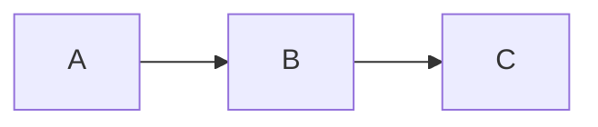

# HedgeDoc Pad Skill

Manage HedgeDoc pads on `pad.lassul.us` — create, read, and edit collaborative markdown documents.

## Instance

- **URL**: `https://pad.lassul.us`
- **Access**: Anonymous (no auth required)

## Script

Use `./pad.sh <command>` (scripts are next to this SKILL.md):

### Read a pad
```bash
./pad.sh read <pad-id>
```

### Create a new pad
```bash
# From stdin
echo "# My Document" | ./pad.sh create

# From a file
./pad.sh create /path/to/file.md
```
Returns the new pad URL.

### Edit a pad (in-place)
```bash
# From stdin
echo "# Updated content" | ./pad.sh edit <pad-id>

# From a file
./pad.sh edit <pad-id> /path/to/file.md
```
Edits the pad in-place via the HedgeDoc websocket API (socket.io + OT). No new pad created.

### Get pad info
```bash
./pad.sh info <pad-id>
```
Returns JSON with title, description, viewcount, timestamps.

## Typical Workflow

1. **Read** the pad: `pad.sh read <id>` → get current markdown
2. **Edit** locally: save modified content to a temp file
3. **Write back**: `pad.sh edit <id> /tmp/updated.md`
4. **Share**: `https://pad.lassul.us/<id>`

## How it works

The edit command connects to HedgeDoc's socket.io websocket, receives the current document state and revision number, then sends an OT (operational transform) operation that deletes all existing content and inserts the new content. The server acknowledges with an `ack` event.

## Mermaid Diagrams

HedgeDoc renders Mermaid diagrams natively. Use fenced code blocks:

````markdown

````

Prefer Mermaid over ASCII art for architecture diagrams, flowcharts, etc. in pads.

**Always quote node labels with special characters** — labels containing `/`, `~`, `*`, `+`, `.`, `:`, `(`, `)` must use double quotes: `Node["~/Mail/new/"]` not `Node[~/Mail/new/]`. Unquoted special chars break Mermaid rendering.

## Notes

- `allowFreeURL = true` — pads can have custom slugs
- `defaultPermission = "freely"` — all pads are world-editable via URL
- Edit replaces the entire pad content (full replacement, not partial edit)
- Active browser sessions will see the change in real-time (pushed via socket.io)
- Pad IDs are from the URL: `https://pad.lassul.us/{PADID}`
- Edit uses UTF-16 code unit counting (JavaScript string length) for OT operations
